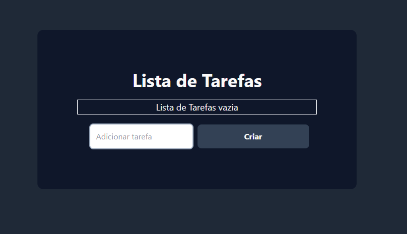

<h1 align='center'>
    
    <p>A lista de tarefas que você precisava</p>
</h1>

## 📕 Sobre

**The List** foi desenvolvido para entender de forma prática como posso utilizar o typesScript com react. Escolhi desenvolver esse projeto simples pela gama de posibilidades que ele entrega na questão de utilização de recursos, como por exemplo: **Requisição de API**, **Hooks - nativos e custom**, **CRUD**, **Armazenamento em um banco de dados - mesmo que fake**.

## 🛠️ Recursos Utilizados

- React;
- [Custom Hooks](https://www.w3schools.com/react/react_customhooks.asp);
- Hooks (useState, useEffect [UseRef](https://www.w3schools.com/react/react_useref.asp));
- react-icons;
- TailwindCSS;
- Axios;

## 👨🏾‍💻 Como rodar o projeto na sua máquina

```bash
# Com a sua chave SSH ativada, selecione a pasta onde você quer colocar esse projeto, abra o terminal nela e depois copie e cole o seguinte comando no seu terminal:

$ git clone git@github.com:leofrs/lista-tarefas-react-typescript.git
```

Após ter feito o clone, instale as dependências necessárias para rodar o projeto. Com a pasta do projeto aberta no terminal, execute os seguintes comandos um por vêz

```bash
# Se você utiliza npm
$ npm i
$ npm i react-icons
$ npm i json-server --global
```

```bash
# Se você utiliza yarn
$ yarn i
$ yarn add react-router-dom
$ yarn add react-icons
$ yarn json-server --global
```

Antes da inicialização do projeto, faça o procedimento as seguir: abra a pasta db no terminal e rode o seguinte comando:

```bash
# Esse comando faz com que o banco de dados fake seja iniciado na porta 3333 do seu pc e com isso você consegue ter acesso as funcinalidades de ler, criar, excluir e atualizar a The List.
$ json-server --watch db.json --port 3333
```

obs: Como este projeto foi criado com o vite, execute o comando **npm run dev** para rodar em sua máquina.

## 🧾 Licença

Este Projeto utiliza a lincença MIT.
